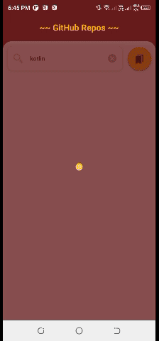

# 株式会社ゆめみ Android エンジニアコードチェック課題

## 概要

本プロジェクトは株式会社ゆめみ（以下弊社）が、弊社に Android エンジニアを希望する方に出す課題のベースプロジェクトです。本課題が与えられた方は、下記の概要を詳しく読んだ上で課題を取り組んでください。

## アプリ仕様

本アプリは GitHub のリポジトリを検索するアプリです。

### 環境

- IDE：Android Studio Iguana | 2023.2.1 Patch 2
- Kotlin：1.9.23
- Java：17
- Gradle：8.4
- minSdk：23
- targetSdk：34
- AGP: 8.3.2

### 動作

1. 何かしらのキーワードを入力
2. GitHub API（`search/repositories`）でリポジトリを検索し、結果一覧を概要（リポジトリ名）で表示
3. 特定の結果を選択したら、該当リポジトリの詳細（リポジトリ名、オーナーアイコン、プロジェクト言語、Star 数、Watcher 数、Fork 数、Issue 数）を表示

### Extra Features
- Abstract error/exception handling mechanism
    - (`jp/co/yumemi/android/code_check/util/exception`)
- Bookmark repositories with Room DB locally.
    - (`jp/co/yumemi/android/code_check/db`)
- Identify different types of errors and exceptions
- API response handling with it's states and network requests
    - (`jp/co/yumemi/android/code_check/util/network`)
- DialogFragment for dialogs
    - (`jp/co/yumemi/android/code_check/util/component`)
- Keyboard related behavior handling
    - (`jp/co/yumemi/android/code_check/util/component/KeyBoardUtil.kt`)
- Navigate to the relevant GitHub page for further references
- Maintain a theme for light and dark
- Test cases
- Localization supports both English and Japanese.
